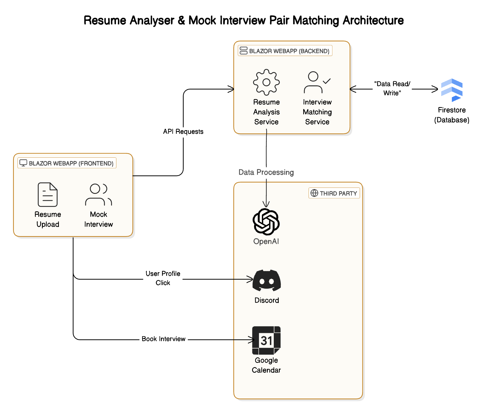

# Resume Analyser & Mock Interview Pair Matching

Welcome to the Resume Analyser & Mock Interview Pair Matching repository. This project leverages AI technology to
provide personalized resume feedback and facilitates interview practice by connecting users with peers and
professionals.

## Table of Contents

- [System Design](#system-design)
- [Features](##features)
- [Getting Started](#getting-started)

## System Design



The architecture consists of a Blazor WebApp for both frontend and backend operations. It integrates with third-party
services like OpenAI for data processing, Discord for user profile interactions, and Google Calendar for booking
interviews.

## Features

- **AI-Powered Resume Feedback**
    - Upload your resume and job description link.
    - Receive personalized feedback from our AI to enhance your application.

- **Reviewer & Referrer System**
    - Connect with experienced professionals who can review your resume or provide referrals to job opportunities.

- **Mock Interview Pairing**
    - Find peers for mock interview practice based on interview type, seniority, and company preferences.

## Getting Started

To get a local copy up and running, follow these steps.

### Prerequisites

- .NET 8.0
- OPENAI API KEY
- FIREBASE CREDENTIALS (service account)

### Installation

   ```bash
   git clone https://github.com/TurTleGodss16/Hackathon_VAIT.git
   cd Hackathon_VAIT
   dotnet build
   ```

To run the app, use either `dotnet run` or `dotnet watch`

  

   